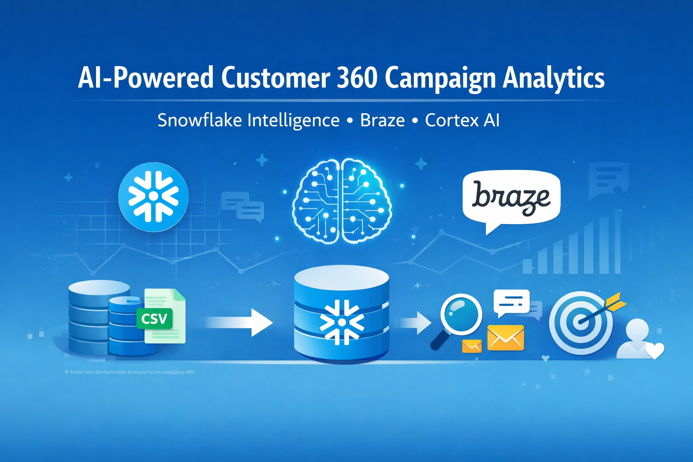

# Build-AI-Powered-Campaign-Analytics-with-Braze-and-Snowflake-Cortex

An AI-powered 360 marketing analytics platform that combines Braze email engagement data with customer product reviews using Snowflake Cortex AI and Snowflake Intelligence. This project demonstrates how marketers can analyze campaign performance and customer feedback using natural language queries.

---

## Project Overview

This solution builds a **Customer 360 Marketing Analytics platform** by integrating Braze campaign engagement data with product reviews in Snowflake.

Using **Snowflake Cortex AI and Snowflake Intelligence**, the system enables marketers to ask natural language questions and receive actionable insights from both structured and unstructured data.

### The platform supports:

- Email campaign performance analysis
- Customer sentiment analysis from product reviews
- Customer segmentation and engagement insights
- AI-driven marketing recommendations

This enables marketing teams to improve campaign targeting and customer engagement strategies.

---
What You Learned
You now have experience with:
•	Setting up Snowflake environment for Braze engagement data and product reviews
•	Creating Semantic Views for structured data analysis with SQL DDL
•	Creating Cortex Search Services for unstructured data analysis (RAG)
•	Using Snowflake Intelligence to query both structured and unstructured data
•	Combining multiple AI tools for comprehensive marketing insights
What You Built
Your complete solution includes:
•	Data Pipeline: Stores and processes Braze email engagement data and product reviews in Snowflake
•	Semantic View: Enables natural language queries on structured campaign data through Cortex Analyst
•	Cortex Search Service: Enables semantic search on unstructured product reviews
•	Snowflake Intelligence Agent: Combines both tools for comprehensive marketing analysis
Key Capabilities
Your solution can:
•	Query email campaign performance using natural language

